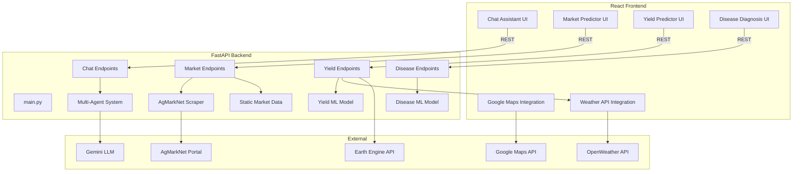

# FarmGenius


> **Empowering Indian agriculture with AI, real-time data, and a beautiful user experience.**

---

## 🚀 Overview
FarmGenius is an advanced, multi-agent agricultural assistant designed for Indian farmers, agri-entrepreneurs, and researchers. It combines AI-driven chat, real-time yield prediction, market price forecasting, and disease diagnosis in a unified, modern platform.

- **AI Chat Assistant**: Nationwide agricultural expertise powered by Gemini LLMs
- **Market Price Prediction**: Real-time and historical mandi prices, time series forecasting
- **Yield Prediction**: Weather-aware, map-based, ML-driven yield estimates
- **Disease Diagnosis**: Crop image upload and instant disease detection
- **Professional UI/UX**: Responsive, modern design

---

## ✨ Features

- 🤖 AI Farming Assistant
- 🌱 Crop Yield Prediction
- 🦠 Plant Disease Detection
- 📈 Market Price Forecast
- 🗺️ Google Maps Integration
- 🌦️ Live Weather Information
- 🎤 Voice Assistant
- 🌍 Multilingual AI Chat
- 📱 Modern Responsive UI
---
**Backend:**
## 🛠 Tech Stack

### Frontend
- React
- Vite
- CSS Modules

### Backend
- FastAPI
- Python

### AI
- Gemini AI

### APIs
- Google Maps API
- OpenWeather API

### Deployment
- Vercel
- Render

**Frontend:**
- React (Vite)
- Modular feature structure
- Google Maps JS API, OpenWeather API
- Modern CSS Modules, context/hooks

---

## 📁 Project Structure

```plaintext
404/
├── backend/
│   ├── app/
│   │   ├── api/                 # FastAPI endpoints (market, yield, disease, chat)
│   │   ├── core/                # Multi-agent logic, AI services, config
│   │   ├── data/                # Static/fallback data
│   │   ├── models/              # Data models
│   │   ├── services/            # Scrapers, ML services
│   │   └── main.py              # FastAPI app entry point
│   ├── requirements.txt
│   └── .env
├── frontend/
│   ├── src/
│   │   ├── features/
│   │   │   ├── chat/            # Chat UI, avatars, animation
│   │   │   ├── market/          # Market price prediction UI
│   │   │   ├── yield/           # Yield prediction with map/weather
│   │   ├── components/          # Shared components
│   │   ├── services/            # API calls
│   │   └── theme/               # Theme (dark/light mode)
│   ├── public/
│   ├── package.json
│   └── .env
└── README.md
```

---

## 🏗️ Architecture

### System Overview



---

## 🖼️ Wireframes

### Home/Dashboard
- **Header**: Logo, navigation (Chat, Market, Yield, Disease), dark/light toggle
- **Main**: Quick links to features, latest market/yield highlights, user tips

### Chat Assistant
- **Left**: Conversation history, agent avatars
- **Center**: Chat window (Markdown, streaming), input box, send button
- **Right**: Contextual tips, share conversation

### Market Predictor
- **Top**: Select commodity, state, market
- **Main**: Price chart (historical & predicted), market info, refresh button
- **Side**: Data source info, last updated

### Yield Predictor
- **Map Panel**: Google Maps with farm selection
- **Form**: Crop, season, acreage, weather (auto-filled)
- **Output**: Predicted yield, recommendations

### Disease Diagnosis
- **Upload**: Image upload box
- **Result**: Detected disease, advice, treatment suggestions

---

## ⚡ Setup & Installation

### Backend
```bash
cd backend
python -m venv venv
source venv/bin/activate  # or venv\Scripts\activate on Windows
pip install -r requirements.txt
cp .env.example .env  # Add your API keys
uvicorn app.main:app --reload
```

### Frontend
```bash
cd frontend
npm install
cp .env.example .env  # Add your API keys
npm run dev
```

---

## ▶️ Usage
- Open `http://localhost:5173` for the frontend.
- Interact with chat, market, yield, and disease features.
- Backend runs on `http://localhost:8000` by default.

---

---

## 💡 Acknowledgements
- AgMarkNet, OpenWeather, Google Maps, Gemini LLM
- Built for hackathons and real-world agricultural impact

---

> For questions or demo requests, open an issue or contact the maintainers.

## 🧠 How FarmGenius Works: Advanced Architecture & Intelligence

### Multi-Agent System & Model Context Protocol
FarmGenius uses a **multi-agent architecture** on the backend. Instead of a single AI module, there are multiple specialized agents:
- **Yield Agent:** Handles crop yield predictions.
- **Disease Agent:** Analyzes plant images for disease detection.
- **Market Agent:** Scrapes and predicts market prices.
- **Chat Agent:** Provides conversational AI support for agricultural queries.

**Why Multi-Agent?**
- **Separation of Concerns:** Each agent is focused and easier to maintain/upgrade.
- **Extensibility:** New agents (e.g., weather, pest, soil) can be added easily.
- **Parallelism:** Agents can work independently or together, improving performance and reliability.

#### Model Context Protocol
This protocol allows agents to share context and state for smarter responses:
- **Context Sharing:** Agents exchange info (e.g., user location, crop type, previous queries) to provide holistic answers.
- **Stateful Interactions:** Enables the system to remember past interactions and tailor recommendations.
- **Example:** If a user asks for a yield prediction and then asks about disease risk for the same crop, the Disease Agent can access info from the Yield Agent’s context.

---

### 🤖 AI Vision & Image Analysis
- **Disease Detection:** Users upload crop images. The backend runs a vision model (deep learning or Gemini Vision API) to analyze the image, returning the detected disease, confidence score, and actionable tips.
- **Pipeline:** Image → Preprocessing → AI Model → Analysis → Response

---

### 💬 Multi-Agent Chat Assistance
- **Gemini 1.5 Pro:** The chat agent uses Google’s Gemini model for natural, context-aware conversations.
- **Coverage:** Answers agri questions for all of India.
- **Markdown & Rich Formatting:** Responses are formatted for clarity (bullet points, code blocks, etc.).
- **Streaming & Sharing:** The chat UI supports streaming responses and lets users share conversations.
- **Intent Routing:** The chat agent can delegate queries to domain agents (e.g., yield, market) and aggregate their responses.
- **Context Awareness:** Maintains conversation context for multi-turn dialogues.

---

### 🌐 Real-Time Market Scraping
- **AgMarkNet Scraper:** Fetches live mandi prices for major crops across India.
- **Nationwide Coverage:** Supports all major agricultural markets.
- **Caching:** Avoids excessive requests by caching recent data.
- **Integration:** Market data is used for both chat responses and the market predictor UI.

---

### 🗺️ Yield Prediction with Geospatial Intelligence
- **Google Maps Integration:** Users can select their farm location for precise predictions.
- **Weather & Soil Data:** Uses APIs and default coefficients for region, season, and crop type.
- **Recommendations:** Provides actionable tips along with yield estimates.

---

### 🏗️ Extensible & Modern Architecture
- **FastAPI Backend:** Modular, async, and production-ready.
- **React + Tailwind Frontend:** Beautiful, mobile-first UI with animated transitions.
- **REST API:** Clean, versioned endpoints for all features.
- **Environment Variables:** Secure management of API keys for Gemini, Google Maps, and OpenWeather.

---

**In summary:**
1. **User interacts with the frontend** (uploads image, asks question, selects location).
2. **Frontend calls the backend API** (RESTful endpoints).
3. **Backend routes the request** to the appropriate agent(s) using the multi-agent system.
4. **Agents process the request**, possibly sharing context or fetching external data.
5. **Response is aggregated** and sent back to the frontend.
6. **Frontend displays the result** with rich UI/UX.

---

## Features
- **Yield Prediction:** Predict crop yields using AI, Google Maps for location, and weather/soil data.
- **Disease Detection:** Upload plant images to detect diseases using AI models.
- **Market Price Prediction:** Get real-time prices for crops across India via AgMarkNet scraping.
- **AI Chat Assistant:** Ask agricultural questions and get contextual answers (powered by Gemini).
- **Modern UI:** Responsive, mobile-first React + Tailwind interface.
- **Multi-agent Backend:** Extensible system for integrating more AI/ML services.

---

## Architecture
- **Frontend:** React, Tailwind CSS, Vite, React Router, Axios
- **Backend:** FastAPI, Python, Gemini API, OpenWeather, Google Maps, AgMarkNet Scraper
- **Communication:** REST API (`/api/v1/...`)
- **Multi-Agent System:** Context protocol for extensibility

```
[ React + Tailwind ] <--> [ FastAPI Backend ] <--> [ AI/ML APIs, Scrapers, DB ]
```

---

## Setup & Installation
### Prerequisites
- Python 3.10+
- Node.js 18+
- npm 9+

### Backend Setup
```bash
cd backend
python -m venv venv
source venv/bin/activate  # On Windows: venv\Scripts\activate
pip install -r requirements.txt
cp .env.example .env  # Set API keys for Gemini, Google Maps, OpenWeather
uvicorn app.main:app --reload
```

### Frontend Setup
```bash
cd frontend
npm install
cp .env.example .env  # Set VITE_GOOGLE_MAPS_API_KEY
npm run dev
```

---

## Usage
- **Yield Predictor:** Enter crop, area, state, and soil/weather info. Select location on map. Get instant yield prediction and recommendations.
- **Disease Detector:** Upload or drag/drop a plant image. Get AI-powered disease analysis and management tips.
- **Market Prices:** View real-time mandi prices for major crops, powered by live scraping.
- **AI Chat:** Ask any agri question and get a contextual, India-specific answer.

---

## API Endpoints
- `POST /api/v1/yield/predict` — Predict crop yield
- `POST /api/v1/disease/detect` — Detect plant disease from image
- `GET /api/v1/market/prices` — Get current mandi prices
- `POST /api/v1/chat/ask` — AI chat assistant

---

## Tech Stack
- **Backend:** FastAPI, Python, Gemini API, OpenWeather, Google Maps, AgMarkNet Web Scraper
- **Frontend:** React, Tailwind CSS, Vite, React Router, React Icons, Axios
- **Testing:** Pytest (backend), ESLint (frontend)

---

## How it Works
### Yield Prediction
- User enters crop, area, state, soil, and weather data.
- Optionally selects exact farm location via Google Maps.
- Backend uses crop coefficients, weather, and soil factors to predict yield.
- Returns yield per hectare and total production, plus actionable recommendations.

### Disease Detection
- User uploads a plant image.
- AI model analyzes the image and returns disease diagnosis and management advice.

### Market Prices
- Backend scrapes AgMarkNet for real-time mandi prices across India.
- Data is cached and aggregated for fast, reliable access.

### AI Chat Assistant
- Seamlessly integrated into the platform with a modern, responsive chat UI (matching the overall design system).
- Powered by Gemini 1.5 Pro for natural, conversational, and context-aware responses.
- Supports Markdown formatting, streaming replies, and sharing of conversations.
- Understands context from other features (e.g., yield, market, disease) for truly smart, multi-turn assistance.
- Designed specifically for Indian agriculture: covers all major crops, regions, and agri practices.

### Multi-Agent System
- Backend is built to allow easy addition of more AI/ML agents and features.

---

## Team & Acknowledgements
- Built for Hackathons by 404
- Special thanks to: FastAPI, React, Google, OpenAI, AgMarkNet, and the open-source community.

---

## License
MIT
